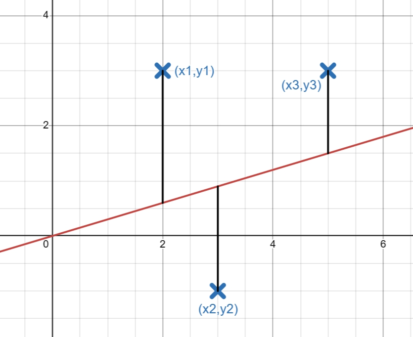

# 线性回归
线性回归(Linear regression)是一种利用线性函数对自变量(特征)和因变量(标签)之间的关系进行建模的方法。在线性回归中，自变量x可以是任何值，但是标签必须是数值(1.2345，890 ...),而非逻辑数(是或不是，有时也用1或0布尔值表示逻辑)。
## 一.从房价问题开始
现在，我们希望使用机器学习算法，通过学习，让计算机自动地算出俄勒冈州波特兰市的房价，那么首先思考下，房价和什么有关系？ 
房价可能与房屋面积，房间总数，是否是市中心等等有关系。计算房价与许多特征有关，设计机器学习算法时，需要将这部分特征考虑进去。 
让我们通过一个例子来开始：这个例子是预测住房价格的，我们要使用一个数据集，数
据集包含俄勒冈州波特兰市的住房价格。在这里，我要根据不同房屋尺寸所售出的价格，画
出我的数据集。比方说，如果你朋友的房子是 1250 平方尺大小，你要告诉他们这房子能卖
多少钱。那么，你可以做的一件事就是构建一个模型。这也是监督学习算法的一个例子。 
让我们先从简单的开始，我们假设房屋的价格只与面积相关,此时问题变为一个单变量线性回归问题,即只有一个特征输入量(面积)，通过机器学习算法，预测一个价格。
### 1.数据集
从网上收集到俄勒冈州波特兰市的房价(y)，与面积(x)的数据。如下: 

 | 面积(x)/英尺 | 价格(y)/1000美金|
 |:-------:|:-------:|
 | 2104 | 460 | 
 | 1416 | 232 |
 | 1534 | 315 |
 | 852  | 178 |
 | ...  | ... |

此时我们称： 

m = 样本数量 
x's   = 输入变量 或 特征 
y's = 输出变量或 标签 

### 2.画出数据集
将表1中的所有数据点以横坐标为面积，纵坐标为价格，画出数据集分布图像。 
  
它被称作监督学习(Supervised Learning)是因为对于每个数据来说，我们给出了“正确的答案”，即告诉我们：根据我们的数据来说，房子实际的价格是多少，而且，更具体来说，这是一个回归问题。回归一词指的是，我们根据之前的数据预测出一个准确的输出值，对于这个例子就是价格，同时，还有另一种最常见的监督学习方式，叫做分类问题，当我们想要预测离散的输出值，例如，我们正在寻找癌症肿瘤，并想要确定肿瘤是良性的还是恶性的，这就是0/1离散输出的问题。更进一步来说，在监督学习中我们有一个经过标注的数据集，这个数据集被称训练集(Training Set)。 

[数据集、训练集、验证集、测试集](../参数调节/数据集、训练集、验证集、测试集.md)

### 3.学习算法工作方式

这就是一个监督学习算法的工作方式，我们可以看到这里有我们的训练集里房屋价格
我们把它喂给我们的学习算法，学习算法的工作了，然后输出一个函数，通常表示为小写ℎ
表示。ℎ代表**hypothes(假设)**，在这里可以认为时一个函数，输入是房屋尺寸的大小，因此h根据输入的x的值来得出y的值，y值对应房子的价格。因此，h是一个从x到y的映射函数。

### 4.单变量线性回归的假设

在接下来的任务中，我们需要首先预设定假设函数的形式。 

一种可能的表达方式为${{h _ \theta}(x) = {\theta _0} + {\theta _1}x}$

这只是简单的假设，实际的问题中，假设可以设置得更加复杂，形如:${h_ \theta }(x)={\theta _0} + {\theta _1}{x} +{\theta _2}{x^2}+...+{\theta _n}{x^n}$ 

在这里我们采用简单的假设。在h中$\theta _i$被称为模型的**参数(Parameters)**,于是，学习问题转变成了如何选择合适的$\theta_i$参数使得h假设最佳。

### 5.代价函数 
如何评估我们的h假设为最佳？如果这时候有个可以参考的建模误差值就可以让我们知道当前选择的模型参数是否是最好的。 
我们可以定义模型所预测的值与训练集中实际值之间的差距（下图中黑线所指）就是建模误差（modeling error）。而蓝色的叉为3个实际的样本点($x_1$,$y_1$)、($x_2$,$y_2$)、($x_3$,$y_3$)，红色直线为预测模型${h_ \theta}(x)$,此时我们可以大致算一下建模误差值，
我们使用${J(θ)}$表示建模误差: 
${J(\theta)}={({y_1}-{h_ \theta}(x_1))} + {({y_2}-{h_ \theta}(x_2))}+{{({y_3}-{h_ \theta(x _3)})}}$

我们的数据点($x_i$,$y_i$) 可以在模型的上方，此时误差为${{y_i}-{h_ \theta}(x_i)}$。然而当我们的数据点($x_i$,$y_i$)在模型下方，此时误差为${{h_ \theta}({x_i}) -{y_i}}$,所以为了在数据点无论在模型上方还是下方都能正确表述模型的误差，我们采用平方式去表示误差，此时误差公式可以表述为： 
${J(\theta)}={({h_ \theta}(x_1)-{y_1})^2} + {({h_ \theta}(x_2)-{y_2})^2}+{({h_ \theta(x _3)}-{y_3})^2}$

误差公式可以视为每个样本点与假设函数ℎ间的误差和，我们需要的将这个误差和作平均，用于表述总体样本与模型的平均误差，即除以样本数量m。但是又由于每个样本是作了平方的，相当于计算了两倍的样本总和，所以我们要除以两倍的样本数量，即除以2m。公式可以总结如下形式:
${J(\theta)}= \frac{{({h_ \theta}(x_1)-{y_1})^2} + {({h_ \theta}(x_2)-{y_2})^2}+{({h_ \theta(x _3)}-{y_3})^2}}{2m}$
 
上式是3个样本时的公式。
对于总数为m个样本，则可以用如下形式表述:

${J(\theta)}= \frac{{({h_ \theta}(x_1)-{y_1})^2} + {({h_ \theta}(x_2)-{y_2})^2}+...+{({h_ \theta(x _m)}-{y_m})^2}}{2m}$

 
最后我们可以总结此公式为更标准的形式:

${J(\theta)}=\frac{1}{2m}\sum\limits_{i=1}^{m}(h_ \theta(x ^{(i)})-y^{(i)})^2$

 
${J(\theta)}$又称之为**代价函数(cost function)**，也可称之为损失函数。在不同的机器学习问题中，损失函数的选择有所不同。在这里，线性回归问题中，选择的损失函数为上述公式，即均方误差函数，是最为合理的选择。

### 6.代价函数的直观理解

对于我们这里所说的房价问题，假设函数包含了两个参数$\theta _1$和$\theta _2$，因此，我们这里的代价函数${J(\theta)}$应当写为${J(\theta _1,\theta _2)}$

由于${J(\theta _1,\theta _2)}$的函数图像太过复杂,我们这里继续简化假设函数${{h _ \theta}(x)}$。
 

由原先的:${{h _ \theta}(x)}={\theta _0}+{\theta _1}x$ 化简为${h _ \theta(x)} = {\theta _1x}$
此时模型的参数仅含有${\theta _ 1}$,代价函数$J(\theta)$表达式为: 
$J(\theta _ 1)=\frac{1}{2m}\sum\limits _ {i=1}^{m}({h _ \theta(x^{(i)})}-{y^{(i)}})^2$

<!-- 由于markdown转latex pdf输出有问题,下标_ 需要在前面和后面都进行空格-->

我们在机器学习的目标就是通过机器学习最小化代价函数，下面将说明为何要最小化代价函数：
当${\theta_1 = 1}$时,